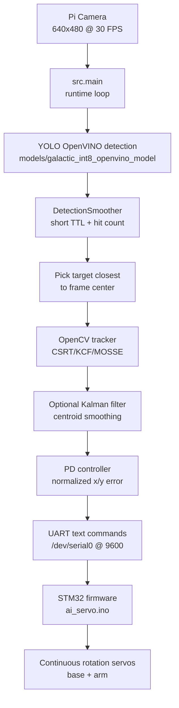
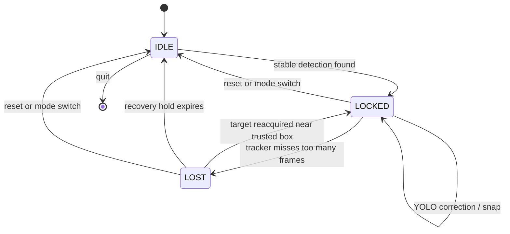
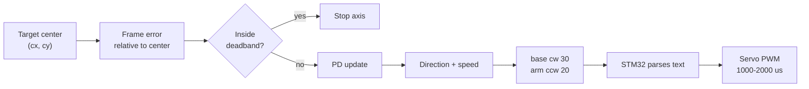

# Precision Tracking

Real-time UAV detection and servo tracking for a Raspberry Pi turret/arm.

This project uses a Raspberry Pi camera, a custom YOLO OpenVINO model, OpenCV tracking, optional Kalman smoothing, and a PD controller to keep a detected target centered in the camera frame. Servo movement is handled by an STM32 board over UART.

## What It Does

- Detects a target with a custom YOLO model exported for OpenVINO.
- Locks onto the best target near the center of the camera frame.
- Tracks the target between detection frames using an OpenCV tracker.
- Rechecks with YOLO to correct tracker drift.
- Smooths target position with an optional Kalman filter.
- Converts target offset into base and arm servo commands.
- Supports AUTO tracking and MANUAL keyboard control.
- Sends simple text commands to STM32 over UART.

## System Overview



## Runtime State Machine



## Control Pipeline



## Repository Layout

```text
Precision-Tracking/
  src/
    main.py          Main camera, detection, tracking, control loop
    config.py        Central tuning and hardware settings
    camera.py        Pi Camera setup and frame capture
    detection.py     YOLO inference and detection smoothing
    tracking.py      OpenCV tracker setup and lock state helpers
    kalman.py        Optional 2D centroid Kalman filter
    controller.py    PD controller and UART command sender
    display.py       OpenCV debug overlay
    utils.py         Geometry and math helpers
  models/
    galactic_int8_openvino_model/
      metadata.yaml  Custom UAV detector metadata
  stm32_firmware/
    ai_servo/
      ai_servo.ino   STM32 servo controller firmware
      mpulogic.ino   MPU6050 angle helper used by ai_servo.ino
  tests/
    run_tests.py     Manual hardware test launcher
    test_pi_camera.py
    test_uart_manual.py
    test_yolo.py
  legacy/
    fianl_auto_manual_tracker_base_arm.py
```

## Hardware

Recommended setup:

- Raspberry Pi 4B or newer.
- Raspberry Pi Camera connected through CSI.
- STM32 board connected to the Raspberry Pi UART.
- Two continuous rotation servos:
  - base rotation servo
  - arm tilt servo

Default UART wiring assumed by the firmware:

```text
Raspberry Pi TX  -> STM32 PA10 RX
Raspberry Pi RX  -> STM32 PA9 TX
Raspberry Pi GND -> STM32 GND
```

Servo pins in `stm32_firmware/ai_servo/ai_servo.ino`:

```cpp
#define BASE_SERVO_PIN PA0
#define ARM_SERVO_PIN  PA1
```

Optional MPU6050 arm X-axis limits:

- `ai_servo.ino` reads MPU angles through `mpulogic.ino`.
- The firmware limits arm movement using `Arm_X`, an absolute gravity-based roll angle.
- Startup still calibrates gyro drift, but it does not zero the safety angle.
- Tune these constants in `stm32_firmware/ai_servo/ai_servo.ino` after watching the USB Serial Monitor output:

```cpp
#define DEFAULT_ARM_X_ZERO_OFFSET_DEG 1.5
const float DEFAULT_ARM_X_MIN_LIMIT_DEG = -90.0;
const float DEFAULT_ARM_X_MAX_LIMIT_DEG = 90.0;
const char ARM_NEGATIVE_X_DIRECTION[] = "CCW";
const char ARM_POSITIVE_X_DIRECTION[] = "CW";
```

Keep the turret still during firmware startup while the MPU calibrates. Watch `RawRoll_X`, `RelRoll_X`, and `Arm_X` in the Serial Monitor. Set the offset so the normal chip-facing-ceiling position makes `Arm_X` read near `0`.

The MPU arm limit can also be tuned at runtime from USB Serial Monitor or Raspberry Pi UART:

```text
limit show
limit offset 1.5
limit zero
limit min -90
limit max 90
limit range -90 90
```

`limit zero` sets the current `RawRoll_X` as the zero offset for this run.

The main app can apply configured MPU limits on startup from `src/config.py`:

```python
MPU_APPLY_LIMITS_ON_START = True
MPU_ARM_X_OFFSET = 1.5
MPU_ARM_X_MIN = -90.0
MPU_ARM_X_MAX = 90.0
```

## UART Protocol

The Python code sends newline-terminated text commands, not binary packets.

Examples:

```text
base cw 30
base ccw 30
base stop
arm cw 25
arm ccw 25
arm stop
all stop
```

The STM32 firmware accepts the same commands from both USB serial and Raspberry Pi UART, which makes it easy to test manually before running the full tracker.

## Configuration

Most tuning lives in `src/config.py`.

Common settings:

```python
TARGET_FPS = 30
FRAME_W = 640
FRAME_H = 480

MODEL_PATH = str(PROJECT_ROOT / "models" / "galactic_int8_openvino_model")
CONF = 0.45
IMGSZ = 640

TRACKER_TYPE = "CSRT"
DETECT_EVERY_N = 2
USE_KALMAN = True

ENABLE_UART = True
SERIAL_PORT = "/dev/serial0"
BAUD_RATE = 9600

KP_X = 0.50
KD_X = 0.10
KP_Y = 0.50
KD_Y = 0.10
```

Direction tuning:

```python
BASE_LEFT_DIR = "ccw"
BASE_RIGHT_DIR = "cw"
ARM_UP_DIR = "cw"
ARM_DOWN_DIR = "ccw"

AUTO_BASE_POSITIVE_X_DIR = "cw"
AUTO_ARM_POSITIVE_Y_DIR = "cw"
```

If a servo moves the wrong way, change the direction strings in `config.py` instead of changing the controller logic.

## Installation

Create a virtual environment:

```bash
python3 -m venv venv
source venv/bin/activate
python -m pip install --upgrade pip
```

Install the runtime packages you need for your platform. The repository currently includes `requirements_from_old_venv.txt`, which was generated from an old environment and may include packages that are unnecessary or unsuitable for Raspberry Pi.

Typical packages:

```bash
pip install ultralytics openvino opencv-contrib-python numpy scipy filterpy pyserial picamera2
```

On Raspberry Pi OS, `picamera2` is often installed through the system packages instead of pip.

## Running

From the repository root:

```bash
python -m src.main
```

Keyboard controls:

```text
m       cycle AUTO/MANUAL/CALIBRATION mode
r       reset tracking state
q/ESC   quit
c       zero current MPU Arm_X position
v       reapply configured MPU limits
b       print one MPU sample

Manual mode:
w       arm up
a       base left
s       arm down
d       base right
SPACE   stop all
+/-     adjust manual speed

Calibration mode:
w/s     arm up/down at low calibration speed
a/d     base left/right at low calibration speed
SPACE   stop all
z       zero current MPU Arm_X position
n       set current Arm_X as min limit
x       set current Arm_X as max limit
b       print one MPU sample
v       reapply configured MPU limits
+/-     adjust calibration speed
```

MPU calibration workflow:

1. Enter `CALIBRATION` mode with `m`.
2. Move the arm to the neutral position and press `z`.
3. Move to the lower physical limit and press `n`.
4. Move to the upper physical limit and press `x`.
5. Press `b` to inspect the current MPU values.
6. Press `m` back to `AUTO`.

## Manual Hardware Tests

Run the test launcher:

```bash
python tests/run_tests.py
```

Available tests:

- UART manual command sender.
- MPU calibration and arm limit command sender.
- Pi Camera preview and FPS check.
- YOLO camera detection demo.

These are hardware smoke tests, not automated unit tests.

For MPU calibration, upload `stm32_firmware/ai_servo/ai_servo.ino` first, then run `test_mpu_calibration.py` from the launcher. The test can send `limit zero`, `limit range -90 90`, and `mpu show` over Raspberry Pi UART.

## Model

The bundled model metadata says it is a custom Ultralytics detection model with one class:

```yaml
names:
  0: uav
```

The configured model path is:

```text
models/galactic_int8_openvino_model
```

## Troubleshooting

### UART does not open

Check the configured serial device:

```bash
ls /dev/serial* /dev/ttyUSB*
```

If you use a USB serial adapter, update:

```python
SERIAL_PORT = "/dev/ttyUSB0"
```

Also make sure the user has serial permissions:

```bash
sudo usermod -a -G dialout $USER
```

Log out and back in after changing groups.

### Camera does not start

Check that the camera is detected:

```bash
libcamera-hello --list-cameras
```

Verify the ribbon cable and camera support in Raspberry Pi OS.

### Tracker type is unavailable

Install OpenCV contrib:

```bash
pip install opencv-contrib-python
```

If CSRT is too slow, try:

```python
TRACKER_TYPE = "KCF"
```

### Servo movement is jerky

Try these in `src/config.py`:

- Keep `USE_KALMAN = True`.
- Reduce `KP_X` and `KP_Y`.
- Increase `KD_X` and `KD_Y` slightly.
- Increase the center deadband with `CENTER_BOX_W` and `CENTER_BOX_H`.
- Lower `AUTO_MAX_SPEED`.

### Auto tracking moves away from the target

Flip the auto direction mapping:

```python
AUTO_BASE_POSITIVE_X_DIR = "ccw"
AUTO_ARM_POSITIVE_Y_DIR = "ccw"
```

Change one axis at a time so you can verify the behavior.

## Current Limitations

- Single-target tracking only.
- Reacquisition depends on the last trusted bounding box.
- No persistent logging or data recording.
- Tests require real hardware.
- Serial port is configured in code.
- The dependency file should be cleaned into a proper Raspberry Pi focused `requirements.txt`.

## Good Next Improvements

- Add a clean `requirements.txt`.
- Add unit tests for geometry, detection smoothing, PD control, and command formatting.
- Add environment variable overrides for serial port and UART enable/disable.
- Add structured logging.
- Add recording/debug output for tuning on captured videos.
- Add a simple calibration mode for servo direction and speed limits.

